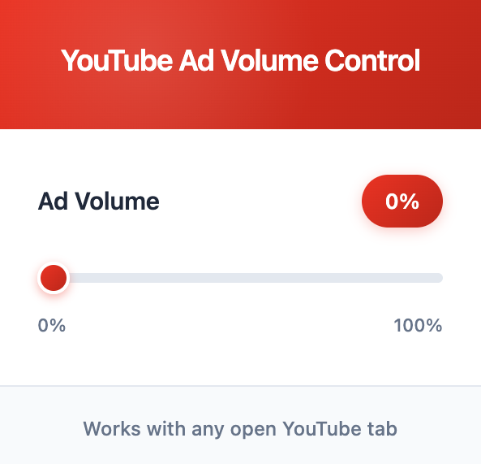

# YouTube Ad Volume Controller | Chrome Extension

This Chrome extension automatically detects when ads start and end, adjusting the volume to a user-defined level. By allowing users to set a specific volume for ads, it creates a consistent and comfortable listening experience without sudden loud interruptions. Ads often play at a higher volume than regular videos, which can be quite annoying. This discrepancy in volume levels inspired the development of this extension. Additionally, by not blocking ads, the extension supports creators and channels, helping them continue to receive ad revenue while maintaining a pleasant experience for users.

## Features

- 🔊 Set volume levels for ads
- 🔄 Automatically restores original volume when ads end
- 🎯 Works only on YouTube domains
- 🖥️ Simple, clean popup interface
- 📊 Development panel for real-time volume monitoring (Ctrl+Shift+D)

## Popup User Interface

## Installation

1. Clone this repository
2. Open Chrome and navigate to `chrome://extensions`
3. Enable "Developer mode" in the top-right corner
4. Click "Load unpacked" and select the extension directory

## Usage

1. Click the extension icon in your Chrome toolbar when on YouTube
2. Use the slider to set your preferred ad volume level (0-100%)
3. The extension will automatically:
   - Detect when ads start playing
   - Lower the volume to your specified ad volume
   - Restore the original volume when the ad ends

### Developer Mode

Press `Ctrl+Shift+D` while on YouTube to toggle the developer panel, which shows:
- Current video volume
- Current ad volume settings
- Development mode status

## Technical Details

- Built with vanilla JavaScript
- Uses Chrome Extension Manifest V3
- Implements `MutationObserver` to detect ad state changes
- Uses Chrome messaging API for popup-content script communication

## Files

- `popup.html` - Extension popup interface
- `content.js` - Main content script for volume control
- `popup.js` - Popup interface logic
- `constants.js` - Shared constants
- `manifest.json` - Extension configuration

## License

MIT License